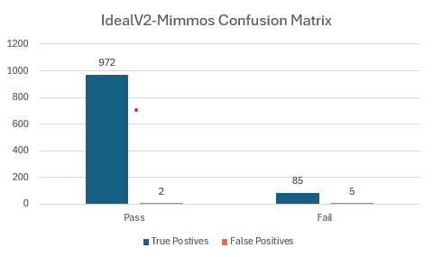
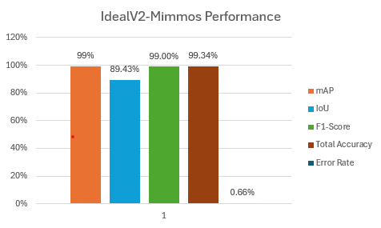
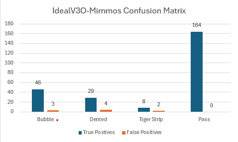
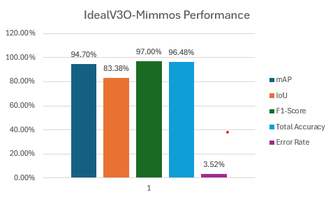

#  Detection & XAI Usage
Step by step configuration to use YoloV4 Darknet framework to perform detection and EigenCAM to explain the detection based on feature maps

## Hardware, Libraries and Tools
###  Dataset - [Clone or Download repository here](https://github.com/ShananSaravanan/mimos_dataset) 

###  Darknet YOLOv4 
*The following configurations are for purposes such as wanting to train the detection model from scratch or to test, validate and retrieve stats such as the mAP, F-1 score, IoU, Confusion Matrix. Requirement to customize Darknet features such as allocating dynamic variable for GUI usability, or deep information retrieving may also require to have Darknet environment locally.*
1. NVIDIA GPU **(Mandatory to run Darknet environment)** - [Check GPU compatibility here](https://developer.nvidia.com/cuda-gpus)
    * CUDA Toolkit - [Download here](https://developer.nvidia.com/cuda-downloads)
    * cuDNN Library - [Download here](https://developer.nvidia.com/cudnn-downloads)
2. Visual Studio Code IDE - [Download here](https://visualstudio.microsoft.com/)
    * Desktop development with C++ Component (Inside VSC)
3. CMake - [Download here](https://cmake.org/download/)
4. Darknet YoloV4 Framework - [Clone or Download repository here](https://github.com/AlexeyAB/darknet)
    * YoloV4 Initial Weights File - [Download here](https://www.youtube.com/redirect?event=video_description&redir_token=QUFFLUhqbU91Nmt1ai0xXy0zV3Y1YXNPREVVNS1FbHVDZ3xBQ3Jtc0tsT1lCanMtbjhCNC16c0JnN3A3NTcxR2F5T211UzZ0cERCZV9tdElfd3pNNnoxYTVzdmtQZkJrb2dqWFY0ejhWd3BGNEFiWHNWbVFReXYzLWd0VU85X0U3ZV9wOHljeVZJTk5oNVRVVEhYQWh0XzY3TQ&q=https%3A%2F%2Fgithub.com%2FAlexeyAB%2Fdarknet%2Freleases%2Fdownload%2Fdarknet_yolo_v3_optimal%2Fyolov4.weights&v=WK_2bpWj35A)
5. OpenCV - [Download here](https://opencv.org/releases/)

###  Mimmos XAI Program - [Clone or Download repository here](https://github.com/ShananSaravanan/mimmos-XAI_YOLOv4) 
*This repository provides important materials such as tools that are needed to run the program and also pre-trained models copyrighted under MIMOS Berhad. If model trained from scratch need to be put into use to utilize the XAI program, then the model has to be exported to this repository through it's respective configurations (.cfg and .weights) file.*

Repository Contents
 1. [Detection Model Files](model) (.cfg and .weights) for :
    - IdealVision2
    - IdealVision 3O
    - IdealVision 4
2. [darknet2pytorch Tool](tool/darknet2pytorch.py) - to convert model to pytorch format
3. [XAI Python Script](EigenCAM_yolov4.py) - to perform detection and utilize EigenCAM to show explanaibility based on the detections

# Used Documentations & Resources
### Darknet YOLOv4
1. Step-by Step guide on how-to setup Darknet YOLOv4 environment into local machine - [Watch here](https://www.youtube.com/watch?v=WK_2bpWj35A)
2. How-to train custom YOLOv4 model from scratch - [View here](https://techzizou.in/train-a-custom-yolov4-object-detector-on-windows/)
3. Documentation on everything related to Darknet framework - [View here](https://pjreddie.com/darknet/yolo/#google_vignette)

## XAI
1. How-to use EigenCAM with its program code - [View here](https://github.com/jacobgil/pytorch-grad-cam/blob/master/tutorials/EigenCAM%20for%20YOLO5.ipynb)
2. How to setup detection model in Python using .cfg and .weights file - [View here](https://korlakuntasaikamal10.medium.com/yolov4-a-comprehensive-guide-to-object-detection-using-darknet-and-opencv-bcf1688f57d7)
3. Why do we need to convert RGB colour scheme to BGR to use OpenCV - [View here](https://www.geeksforgeeks.org/convert-bgr-and-rgb-with-python-opencv/ )

# Performance Measure
### *IdealVision 2*

### *IdealVision 3O*

